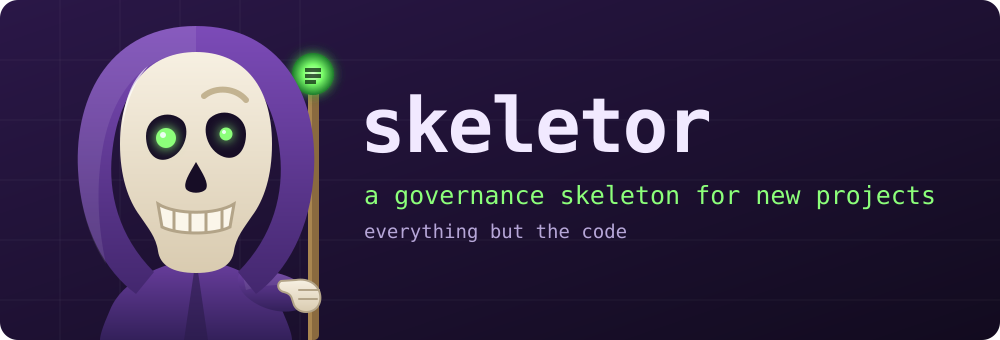

<p align="center">
  
</p>

# skeletor

A **project shell generator**. Run one command in a blank repo and you get a
tree that governs itself from the first commit: documented conventions an agent
loads every session, a docs lifecycle, marker-based tests, cost-aware CI,
versioning, and optionally a scheduled self-maintenance layer.

It is an **executable that copies real files** — not a guide an agent reads and
then hand-writes files from.

---

## What's in the box

Everything below is generated into your new repo. The **Tier** column says which
tier ships it: `C` = core, `G` = governed, `A` = agentic (cumulative).

### skeletor's own tools

| Tool | What it does |
| ---- | ------------ |
| `bin/skeletor-new` | The generator — copies overlays, substitutes placeholders, verifies the result |
| `bin/skeletor-verify` | Generates every tier and runs each tree's own gates — this repo's test suite |
| `bin/skeletor-check-pins` | Reports how far behind every version the template pins users to |
| `bin/skeletor-upgrade` | Carries a template change into an already-scaffolded tree — three-way merge, never a conflict marker |
| `bin/skeletor-install-skill` | Installs `/new-project` into `~/.claude/skills/`, rewriting the path to this checkout |
| `/new-project` skill | Lets any agent scaffold a repo from a plain-English ask |
| `AGENTS.md` | The same procedure as a page an agent can be pointed at directly |

### The project CLI (`./<cli>`)

One discoverable entry point. Command groups are **discovered by module**, so an
overlay can add one without patching an import list.

| Group | Subcommands | Tier |
| ----- | ----------- | ---- |
| `check` | `lint` · `docs` · `doc-links` · `doc-refs` · `reports` · `merge-drivers` · `pre-push` · `health` | C |
| `test` | `unit` · `integration` · `manual` · `all` · `coverage` | C |
| `docs` | `index` · `status` · `file` · `queue-order` · `release-window` · `freeze-release` | C |
| `bug` | Capture an out-of-scope bug; refuses one missing any of its four sections | C |
| `commit` | Scoped commit that skips pre-commit's repo-wide stash | G |
| `worktree` | `new` · `drop` · `list` · `holders` | G |
| `report` | `<job>` · `cron` · `watch` | A |

### Agent governance (`.claude/`)

| Capability | Detail | Tier |
| ---------- | ------ | ---- |
| Rules | `commits` · `docs` · `testing` · `workflows` (+ `python`/`javascript` by overlay) | C |
| Permission allowlist | `settings.json` — pre-approved git/gh/lint/CLI calls | C |
| Session bootstrap | `hooks/session-start.sh` installs the host toolchain in remote sessions | C |
| Shared-tree rule | The rule that stops one agent deleting another's uncommitted work | G |
| Subagents | `implementer` · `tester` · `documenter` | A |
| Skills | `/implement` (plan → code → tests → docs → filed) · `/release` (phased, stops for a human) | A |

### Documentation lifecycle

| Capability | Detail | Tier |
| ---------- | ------ | ---- |
| Holding tank ↔ archive | `docs/TODO/` and `docs/implementations/`; a plan **moves**, never copies | C |
| Generated indexes | 2 JSON + 2 READMEs, rebuilt in dependency order by `scripts/docs/regen.py` | C |
| Plan classification | `shelf_status` · `blocked_on` gate · `queue_order` · `review_pr` — the last three never inferred | C |
| One imported sort key | `queue_order.py` — the published queue order *is* the real one | C |
| Lazy-loading index | `.github/DOCS_INDEX.md` — a task loads 1–3 docs, not the tree | C |
| Release-anchored reports | `release_window.py` — every report scoped to `<tag>..HEAD` | C |
| Release freeze | `freeze_release.py` — archives editions, re-anchors, refuses a re-freeze | C |
| Merge driver | `regen-docs` — generated files are regenerated on merge, never hand-resolved | C |
| Plan template | `_TEMPLATE.md`, including the `## Dropped, and why` section | C |

### Validation gates

Every one is runnable locally with the same invocation CI uses.

| Gate | Catches | Tier |
| ---- | ------- | ---- |
| `check_doc_tables.py` | A doc registered in neither index table (`AGENTS.md`, `.github/DOCS_INDEX.md`) — one no agent will load | C |
| `check_doc_links.py` | Dead relative links and `#fragments` (ratchet); `--fix` repoints the unambiguous ones | C |
| `check_source_doc_refs.py` | `docs/*` paths cited from source comments that no longer resolve | C |
| `regen.py --check` | A generated index that is stale in the commit that changed its source | C |
| `release_window.py --check` | A report whose anchor is missing, malformed, or wrong for where it lives | C |
| `check_skip_budget.py` | A suite that quietly stopped testing (ratchet) | C |
| `check_coverage_budget.py` | Coverage sliding while nobody looks (ratchet) | C |
| `install_merge_drivers.py --check` | A checkout missing the driver, plus regenerations owed | C |
| `check_output_discipline.py` | A status symbol or a stream picked outside `scripts/output.py` — auto-enrolled | C |
| `check_workflow_drift.py` | Two CI jobs that boot the stack diverging — auto-enrolled, not a registry | G |
| `tree_lock.py` | Whether a branch change would strand somebody's work | G |

### Testing

| Capability | Detail | Tier |
| ---------- | ------ | ---- |
| Marker registration | A file joins a suite by declaring `pytestmark` — no registry anywhere | C |
| CLI smoke + flag contract | Every command answers `--help` and every read-only one runs; a flag the CLI forwards must be one the script defines | C |
| Docs lifecycle end-to-end | A plan **moves** to the archive and every index follows — run on a disposable copy of the tree | C |
| `require_or_skip` | Skips locally, **fails** in CI, so "green" means "ran" | C |
| Ratchets | Skip count and coverage, each moved deliberately in the same commit | C |
| Shipped tests | `marker_coverage` · `docs_pipeline` · `ci_draft_gate` · `lint_tool_parity` | C |
| Suite hardening | `--strict-markers`, return-not-none as an error, per-test timeout sized for CI | C |
| Registry tests | `reporting_jobs` — registry ↔ CLI ↔ prompts ↔ heartbeats ↔ cron collisions | A |

### CI/CD and cost control

| Capability | Detail | Tier |
| ---------- | ------ | ---- |
| Gate job | Computes `full_suite`/`docs_only` once; every expensive job is gated on it | C |
| Draft discipline | A draft PR runs the gate alone; `ready_for_review` runs the full set | C |
| Shared docs-only definition | `docs-only.cjs`, required by both workflows, **fail-open** | C |
| Job-level skipping | Never `paths-ignore` — a required check that never reports blocks forever | C |
| Docs validation workflow | PR-only, by design; the nightly covers direct pushes | C |
| Draft-discipline bot | Comments on a PR opened ready, with the cheaper loop | C |
| Nightly coverage | The expensive suites, off the pre-merge path | G |
| Dependabot | Exempt from gating so bumps actually run the suite before auto-merge | G |
| CODEOWNERS + templates | Bug/feature forms shaped like an actionable capture | G |

### Code governance

| Capability | Detail | Tier |
| ---------- | ------ | ---- |
| Blocking lint set | flake8 `E9,F63,F7,F82,F401` + isort + black; complexity flagged, not blocked | C |
| Whole-project types | pyright `standard` in both the hook and CI — one stale error blocks everyone | C |
| One version pin | `.pre-commit-config.yaml` is the source of truth; parity test enforces mirrors | C |
| Pre-commit hooks | Conventional commit-msg, `.env` block, large-file guard, docs gates | C |
| ESLint ratchet | `--max-warnings=<baseline>`, whole-tree, may only go down | C |
| Prettier | Owns formatting so no lint rule has to argue with it | C |

### Versioning and release

| Capability | Detail | Tier |
| ---------- | ------ | ---- |
| Conventional commits | One subject line, enforced by hook; type decides the bump | C |
| Release Please | Generates `CHANGELOG.md` and `VERSION` — never hand-edited | C |
| `.gitmessage` | The template, with the bump each type causes | C |
| Report freeze | A release closes the window; editions become an immutable record | C |
| `/release` skill | Five phases across turns; **stops** for a human to merge | A |

### Scheduled self-maintenance

| Capability | Detail | Tier |
| ---------- | ------ | ---- |
| One registry | `jobs.py` generates the crontab, the CLI subcommands and the viewer | A |
| Collection/triage split | Deterministic stdlib collection, then a headless agent over the result | A |
| `fix_policy` | `none` by default — blast radius is a decision, not an inheritance | A |
| Outcome ledger | Two rails: no `ok` without an agent run; no `ok` on a red gate | A |
| `declined` as an outcome | An executed-and-declined job still pings its heartbeat | A |
| Heartbeats | One per job, asserted present in `.env.example` by a test | A |
| Worked example | `repo-report` end to end — registry, module, prompt, heartbeat | A |

---

## Using it from a blank repo

Three ways, in order of how little you have to remember.

### 1. Ask your agent (recommended)

In the blank repo, say:

> **"Set up this project using skeletor."**

The `/new-project` skill (installed at `~/.claude/skills/new-project/`) records
where skeletor lives and sends the agent to [`AGENTS.md`](AGENTS.md) for the rest
— it carries no procedure of its own, so it cannot go stale against one. If the
skill is not installed, install it with:

```bash
~/skeletor/bin/skeletor-install-skill
```

### 2. Point the agent at this repo

> **"Read `~/skeletor/AGENTS.md` and follow it to set up this repo."**

[`AGENTS.md`](AGENTS.md) is a one-page instruction sheet written for exactly that
prompt, and it is the same file the skill above hands you off to. This route just
skips the install.

### 3. Run it yourself

```bash
~/skeletor/bin/skeletor-new . --force \
  --name "My Project" --cli mp --tagline "What it is." --tier core
```

Then read [`docs/SETUP_GUIDE.md`](docs/SETUP_GUIDE.md) from Step 2 on.

---

## What you get

```bash
bin/skeletor-new ../my-project --name "My Project" --cli mp --tier core

cd ../my-project
python -m venv .venv && .venv/bin/pip install -r scripts/requirements.txt
.venv/bin/pre-commit install --install-hooks
./mp check docs && ./mp test unit     # green from the first run
```

| Tier | Adds |
| ---- | ---- |
| `core` | Agent rules, lazy-loading docs index, plan lifecycle, CLI, marker tests, CI gate, versioning |
| `governed` | Multi-agent tree safety, scoped commits, worktrees, drift checks, ratchets |
| `agentic` | Subagents, `/implement` + `/release` skills, a scheduled-job registry |

See [`docs/TIERS.md`](docs/TIERS.md) for what each costs. Pick the one you will
maintain, not the one that looks most thorough.

---

## Repository layout

| Path                        | What it is                                            |
| --------------------------- | ------------------------------------------------------ |
| `AGENTS.md`                 | One-page instruction sheet for an agent doing a setup  |
| `bin/skeletor-new`          | The generator: copies overlays, substitutes, verifies  |
| `bin/skeletor-install-skill`| Installs the `/new-project` skill for your account     |
| `.claude/skills/new-project/` | The skill's source                                   |
| `template/core/`            | Tier 1 — always take this                              |
| `template/governed/`        | Tier 2                                                 |
| `template/agentic/`         | Tier 3                                                 |
| `template/python/`, `node/` | Language overlays (lint, types, formatting)            |
| `docs/SETUP_GUIDE.md`       | The full procedure, including adoption into an existing repo |
| `docs/TIERS.md`             | What each tier buys, and what it costs                 |
| `docs/DESIGN_RATIONALE.md`  | The incident behind each mechanism                     |

---

## The idea

> A rule that two files can express is a rule that will drift, and the copy that
> is wrong is always the one being read.

Where a set of things must be checked, the set is **discovered** by pattern — any
test file with a marker, any CI job that boots the stack — rather than maintained
as a list. Exemptions live in an allowlist **with a written reason**, which is
what turns a divergence from a failure into a decision.

The second idea is smaller and matters as much: **write the reason next to the
rule.** A rule whose reason is written down can be evaluated when it becomes
inconvenient. A rule without one gets deleted by whoever trips over it first.

---

## Verifying a change to the template

```bash
bin/skeletor-new /tmp/probe --name Probe --cli probe --tier agentic --tagline x --force
cd /tmp/probe && python -m venv .venv && .venv/bin/pip install -q pytest click
.venv/bin/python -m pytest tests/ -m unit -q     # must be green
./probe check docs                                # must be 5/5
```

A scaffold whose first check is red teaches that red is normal — so the shell's
own definition of done is that a fresh tree passes its own gates.
